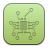

# Moka Extra Icons

Custom icons for Moka Icon Theme of the [Moka Project](https://snwh.org/moka) made by [Sam Hewitt](http://snwh.org/).

[](https://creativecommons.org/licenses/by-sa/4.0/)
[](https://creativecommons.org/licenses/by-sa/4.0/)

 <!-- General -->


   <!-- Changed -->


 <!-- Programming -->





 <!-- Blizzard Games -->


     <!-- Games -->


 <!-- Chrome Icons -->


Moka Icon Theme (the icon assets and sources) are licensed under a [Creative Commons Attribution-ShareAlike 4.0](http://creativecommons.org/licenses/by-sa/4.0/legalcode) license.

Any bundled software is free software; you can redistribute it and/or modify it under the terms of the GNU General Public License as published by the Free Software Foundation; either version 3, or (at your option) any later version.

## Downloading the original Icon Theme

The original source for Moka Icon Theme can be found [here](https://github.com/snwh/moka-icon-theme). You can clone the latest version from the git repository:

	git clone https://github.com/snwh/moka-icon-theme.git

## Using the Source

There are scripts to simplify the rendering process; to run them (and edit icons) you will need:

 * inkscape
 * python3
 * gtk-engine-murrine (optional)

To render new icons from their source SVG files, run the following:

	python render-bitmaps.py

If it's throwing an error, the script may not be executable, try:

	chmod +x render-bitmaps.py

This script will look in the source directory `(../src/*)` and render the respective icons (provided there are changes).

## Installation

Simple, you just run the script from the root of the source folder:
```bash
./INSTALL
```
Keep in mind that you will need to manually change some `Icon=` key in some `.desktop`  for the icons to work (e.g., programs installed via Wine).

Note that the script will not install `exe-thumbnailer` and `gnome-shell-extensions` custom icons.

## Implemented Icons

Some of the icons have been added to the upstream theme:

 * battlenet
 * clinica
 * qtiplot
 * sketchup
