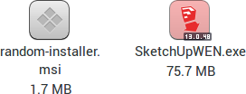

## exe-thumbnailer

Moka icons for [exe-thumbnailer](https://github.com/exe-thumbnailer/exe-thumbnailer) (formerly gnome-exe-thumbnailer).

## Installation
This is not really necessary, as the icons have already been [merged](https://bugs.launchpad.net/ubuntu/+source/gnome-exe-thumbnailer/+bug/1404744) into the upstream.

All you need to have an up-to-date version of `exe-thumbnailer` on your system.
